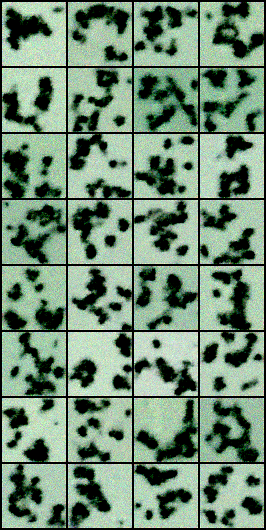
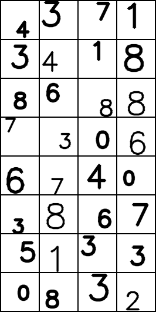

# DiffuTest: Conditional Diffusion for Next-Digit Image Generation

This repository demonstrates a simple conditional diffusion model that learns to generate an image of digit `n+1` given an image of digit `n`. The dataset is synthetically generated on-the-fly using OpenCV and PIL, and the model is a U-Net with residual and transformer blocks.

## Training

Configure your experiment in `configs/config.yaml` (see [hydra](https://hydra.cc/) for details).

To train:
```bash
python train.py
```

## Results

| Epoch | Input (Digit n) | Target (Digit n+1) | Model Output |
|:-----:|:--------------:|:------------------:|:------------:|
|   1   |  |  |  |
|   7   |    |   |      |
|   15   |    |   |      |
|   100   |    |   |      |
|   500   |    |   |      |

